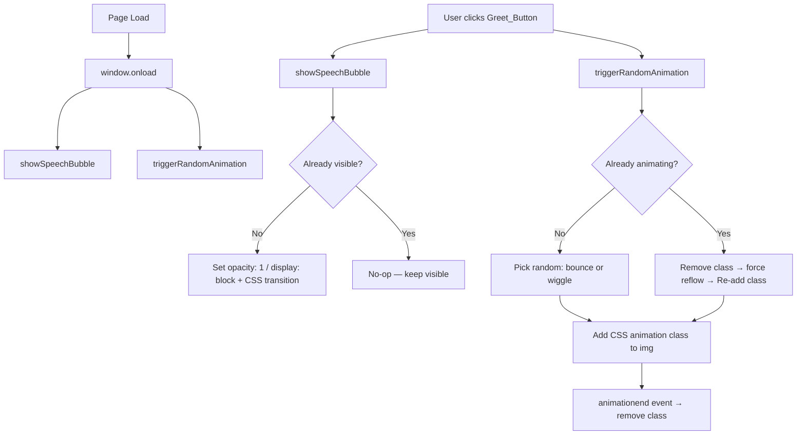

# Design Document: Puppy Interactive Website

## Overview

The Puppy Interactive Website is a single, self-contained HTML file that renders a cheerful, child-friendly page featuring a centered puppy image. Users can interact via a "Sapa Anak Anjing" button that triggers a speech bubble greeting and a randomized puppy animation. The page auto-animates on load to create an immediately engaging experience.

The design deliberately avoids any build tooling, server-side logic, or external JS libraries. All styles are provided by Tailwind CSS loaded from CDN, and all behaviour is implemented in Vanilla JavaScript embedded directly in the HTML file.

### Key Design Goals

- **Zero dependency delivery**: `file://` protocol works without any server or build step.
- **Child-friendly aesthetics**: Soft pastel palette, rounded corners everywhere, large readable text.
- **Accessible interaction**: WCAG AA contrast, keyboard-reachable button with visible focus ring.
- **Lively on arrival**: Speech bubble and one animation play immediately on page load.

---

## Architecture

Because the entire application is a single HTML file, there is no traditional client/server split or module system. The architecture is instead organized as three logical layers within one file:

```
index.html
├── <head>
│   ├── Tailwind CSS CDN <script> (Play CDN for JIT utility support)
│   └── <style> block — custom @keyframes for bounce and wiggle, speech bubble tail
├── <body>
│   └── <main> — semantic page root
│       ├── <section id="puppy-card"> — card wrapper
│       │   ├── <div id="speech-bubble-wrapper"> — relative positioning anchor
│       │   │   └── <div id="speech-bubble"> — greeting overlay
│       │   └──  — puppy illustration
│       └── <button id="greet-btn"> — "Sapa Anak Anjing"
└── <script> — all Vanilla JS behaviour
```



### Tailwind CDN Strategy

The design uses the **Tailwind CSS Play CDN** (`https://cdn.tailwindcss.com`) rather than the legacy CDN. The Play CDN is the officially recommended browser-ready option and supports JIT so all utility classes are available without a config file. A `tailwind.config` block is embedded inline to extend the default theme with the custom pastel background color.

---

## Components and Interfaces

### 1. Page Shell (`<html>`, `<head>`, `<body>`, `<main>`)

Provides the semantic document structure. `<main>` acts as the single landmark region containing everything visible. CSS on `<body>` and `<main>` centres the puppy card both vertically and horizontally using Flexbox.

### 2. Puppy Card (`#puppy-card`)

A `<section>` that groups the speech bubble wrapper and the puppy image into a single vertical stack. The card has no visible border; its purpose is to give a positioned parent for the speech bubble overlay.

**Key properties:**
- `position: relative` — required so the speech bubble can be positioned absolutely above the image.
- Flexbox column layout with `align-items: center`.

### 3. Speech Bubble (`#speech-bubble`)

An absolutely-positioned `<div>` rendered above the puppy image.

| Property | Value |
|---|---|
| Initial state | `opacity: 0`, `pointer-events: none`, `display` remains block for layout purposes — a separate hidden class toggles opacity |
| Visible state | `opacity: 1`, `pointer-events: auto` |
| Transition | `opacity 300ms ease-in-out` |
| Background | White (`#ffffff`) — visually distinct from the pastel page background |
| Border-radius | `12px` (≥ 8px) |
| Tail | A CSS pseudo-element `::after` triangle pointing downward toward the puppy |
| Text | Fixed to `"Halo! Guk guk! 🐾"` |

**Visibility approach**: The speech bubble uses an `opacity` + `visibility` transition pair rather than `display: none` toggling. This allows the CSS `transition` to animate properly:

```css
#speech-bubble {
  opacity: 0;
  visibility: hidden;
  transition: opacity 300ms ease-in-out, visibility 300ms;
}
#speech-bubble.visible {
  opacity: 1;
  visibility: visible;
}
```

JavaScript adds/removes the `visible` CSS class — it never touches `display`.

### 4. Puppy Image (`#puppy-img`)

An `` element sourced from `https://placedog.net/400/400` with `alt="Cute puppy"`.

| Property | Value |
|---|---|
| `src` | `https://placedog.net/400/400` |
| `alt` | `"Cute puppy"` |
| CSS width | `w-64` (256px) on mobile, `w-80` (320px) on `sm:` — both within 200–400px |
| Border-radius | `rounded-2xl` (16px) |
| Animation class | Either `.animate-bounce-puppy` or `.animate-wiggle-puppy` added by JS |

### 5. Greet Button (`#greet-btn`)

A `<button>` element below the puppy image.

| Property | Value |
|---|---|
| Label | `"Sapa Anak Anjing"` |
| Background | `bg-pink-400` (#f472b6) |
| Text color | `text-white` (#ffffff) — contrast ratio ≈ 4.6:1 (passes WCAG AA) |
| Border-radius | `rounded-xl` (12px) |
| Font size | `text-lg` (18px) |
| Hover | `hover:bg-pink-500` (lightness drops ~10%) + `hover:scale-105` |
| Focus | Tailwind's default `focus:ring-2 focus:ring-pink-600 focus:outline-none` |
| Keyboard | Native `<button>` — Tab-reachable, Enter/Space activatable by default |

### 6. Animation Classes (CSS `@keyframes`)

Two animation keyframes are defined in a `<style>` block:

**Bounce:**
```css
@keyframes bouncePuppy {
  0%, 100% { transform: translateY(0); }
  25%       { transform: translateY(-18px); }
  50%       { transform: translateY(0); }
  75%       { transform: translateY(-10px); }
}
.animate-bounce-puppy {
  animation: bouncePuppy 800ms ease-in-out;
}
```
- Duration: 800ms (within 600–1200ms).
- Max displacement: 18px (≤ 20px).
- Repetitions: effectively 2 up-down cycles.
- Returns to `translateY(0)` at 100% — no snap.

**Wiggle:**
```css
@keyframes wigglePuppy {
  0%, 100% { transform: rotate(0deg); }
  20%       { transform: rotate(12deg); }
  40%       { transform: rotate(-12deg); }
  60%       { transform: rotate(10deg); }
  80%       { transform: rotate(-8deg); }
}
.animate-wiggle-puppy {
  animation: wigglePuppy 800ms ease-in-out;
}
```
- Duration: 800ms (within 600–1200ms).
- Max rotation: ±12 degrees (≤ ±15 degrees).
- Repetitions: 4 direction changes.
- Returns to `rotate(0deg)` at 100% — no snap.

### 7. JavaScript Module (`<script>`)

All logic lives in a single `<script>` tag at the bottom of `<body>`. No modules or imports are used to keep `file://` compatibility.

**Public interface** (functions and event listeners):

| Function | Signature | Description |
|---|---|---|
| `showSpeechBubble()` | `() => void` | Adds `.visible` class to `#speech-bubble` if not already present. Idempotent. |
| `triggerAnimation()` | `() => void` | Randomly picks bounce or wiggle class. If already animating (flag), removes the class, forces reflow, then re-adds. Cleans up on `animationend`. |
| Window `load` handler | — | Calls `showSpeechBubble()` and `triggerAnimation()`. |
| Button `click` handler | — | Calls `showSpeechBubble()` and `triggerAnimation()`. |

---

## Data Models

This is a purely presentational application with no persistent state, network requests, or data stores. The only runtime state is maintained as simple JavaScript variables:

### Animation State

```js
let isAnimating = false;          // guard flag — prevents stacking animations
let currentAnimClass = null;      // tracks which class was last added ('animate-bounce-puppy' | 'animate-wiggle-puppy')
```

### Speech Bubble State

No explicit state variable is needed. The visibility state is derived directly from the DOM: the speech bubble is visible if and only if it has the `visible` CSS class. `showSpeechBubble()` uses `classList.contains('visible')` before acting.

### Animation Selection

```js
const ANIMATIONS = ['animate-bounce-puppy', 'animate-wiggle-puppy'];
// selected per click:
const chosen = ANIMATIONS[Math.floor(Math.random() * ANIMATIONS.length)];
```

No other data models exist. All content (greeting text, image URL, button label) is hard-coded in HTML.

---

## Correctness Properties

*A property is a characteristic or behavior that should hold true across all valid executions of a system — essentially, a formal statement about what the system should do. Properties serve as the bridge between human-readable specifications and machine-verifiable correctness guarantees.*

### Property 1: Speech bubble visibility is idempotent

*For any* initial speech bubble state, calling `showSpeechBubble()` one or more times should always result in the speech bubble being visible — repeated calls must not toggle it off or cause any change after the first call makes it visible.

**Validates: Requirements 3.3, 3.7, 6.1**

---

### Property 2: Animation always returns to neutral position

*For any* animation class applied to the puppy image (bounce or wiggle), when the animation completes the `transform` property on the puppy image element SHALL be equivalent to `none` / the identity transform (translateY(0), rotate(0deg)).

**Validates: Requirements 5.4**

---

### Property 3: Random animation selection is unbiased

*For any* large number of `triggerAnimation()` calls (≥ 100), the proportion of bounce vs wiggle selections should be approximately 50% each (within a reasonable statistical tolerance), confirming that neither animation is systematically suppressed.

**Validates: Requirements 5.1**

---

### Property 4: Animation restart clears previous state

*For any* state where the puppy image is currently animating, calling `triggerAnimation()` again must result in the animation restarting from the beginning — the `animationend` handler from the previous run must not fire after the new animation starts and remove the new animation class prematurely.

**Validates: Requirements 5.5**

---

### Property 5: Speech bubble always shows greeting text when visible

*For any* state where the speech bubble has the `visible` class, the text content of the speech bubble element should be non-empty and equal to one of the specified greeting messages.

**Validates: Requirements 3.4, 3.3**

---

## Error Handling

### Image Load Failure

The `` element's natural browser fallback handles this: if `placedog.net` is unreachable, the browser renders the `alt="Cute puppy"` text in place of the image. No JavaScript error handler is needed. All other elements (speech bubble, button) use absolute/flex positioning relative to the card container, so they remain correctly positioned regardless of whether the image loads.

An optional `onerror` attribute can add a local placeholder:

```html

```

The second `this.onerror=null` prevents infinite loops if the fallback also fails.

### Animation Edge Cases

- **Rapid repeated clicks**: The `isAnimating` flag + forced reflow restart pattern prevents stacking. The `animationend` handler uses the guard flag to ensure only the most-recent animation's cleanup runs.
- **Tab/keyboard activation**: The `<button>` element fires `click` events on Enter and Space natively — no special keyboard handling is required.

### Zero Console Errors

- All DOM queries use `document.getElementById()` with IDs that are guaranteed to exist in the same file — no null dereference risk.
- The Tailwind Play CDN is loaded with a `<script>` tag (not `<link>`) — the correct method for the Play CDN.
- No `async` operations, no Promises, no network calls from JS — eliminates the entire class of async rejection errors.

---

## Testing Strategy

Because this feature is a single HTML file with no build system, testing is performed by opening the file in a browser and verifying behaviour manually, supplemented by automated property-based and unit tests for the JavaScript logic functions that can be extracted and tested in isolation.

### Unit Tests

Target the pure-logic functions that can be extracted and tested outside the browser:

| Test | What it checks | Type |
|---|---|---|
| `showSpeechBubble()` idempotence | Call once → visible; call again → still visible, no DOM errors | Example |
| `showSpeechBubble()` on load | After `window.load` fires, speech bubble has `visible` class | Example |
| Animation class removal | After `animationend`, neither bounce nor wiggle class is present on image | Example |
| Animation restart | Click during animation → old `animationend` does not remove new class | Example |
| `alt` text presence | `#puppy-img` has non-empty `alt` | Example |
| Button label | `#greet-btn` text content equals `"Sapa Anak Anjing"` | Example |
| `<!DOCTYPE html>` present | File starts with doctype declaration | Example |

### Property-Based Tests

These verify universal properties of the JS logic using a PBT library such as [fast-check](https://github.com/dubzzz/fast-check) (can be run via a test harness that mocks the DOM with jsdom):

Each property-based test should run **minimum 100 iterations**.

| Property | Test description | Tag |
|---|---|---|
| Property 1: Idempotent show | *For any* call count N ≥ 1, calling `showSpeechBubble()` N times leaves the bubble visible | `Feature: puppy-interactive-website, Property 1: Speech bubble visibility is idempotent` |
| Property 2: Animation neutral return | *For any* animation type, after `animationend` fires, `transform` is identity | `Feature: puppy-interactive-website, Property 2: Animation always returns to neutral position` |
| Property 3: Unbiased random selection | *For any* sample of 100 calls, both animation types appear at least once | `Feature: puppy-interactive-website, Property 3: Random animation selection is unbiased` |
| Property 4: Restart clears state | *For any* in-progress animation, a second call restarts and previous cleanup does not affect new run | `Feature: puppy-interactive-website, Property 4: Animation restart clears previous state` |
| Property 5: Bubble text when visible | *For any* visible state, bubble text equals one of the two valid greeting messages | `Feature: puppy-interactive-website, Property 5: Speech bubble always shows greeting text when visible` |

### Manual / Browser Acceptance Tests

These are validated by opening the file in Chrome, Firefox, and Edge:

| Criterion | Verification method |
|---|---|
| Pastel background (HSL saturation ≤ 30%, lightness ≥ 85%) | Browser DevTools Colour Picker |
| Image centered within 10px of viewport center | DevTools ruler / computed layout |
| No horizontal scrollbar at 320px | Responsive Mode in DevTools |
| WCAG AA contrast on button | WebAIM Contrast Checker |
| Focus ring visible on Tab | Keyboard navigation |
| Zero `console.error` entries | DevTools Console on load |
| Speech bubble and animation on load | Visual observation |
| `file://` works without server | Open file directly in browser |
